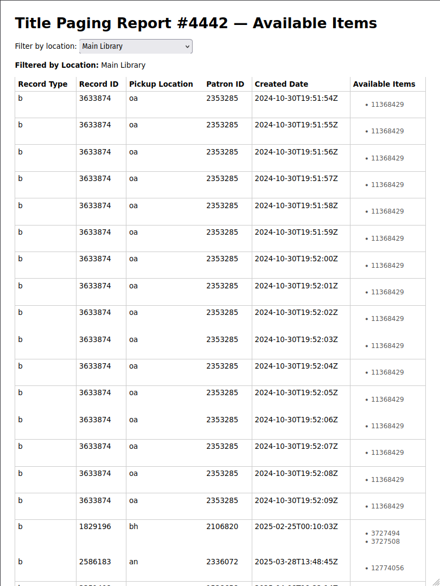

# Sierra Enhanced Title Paging (ETP)

A web application for working with Sierra ILS Title Paging Reports

## Quick Start

1. Clone this repo
1. Create and activate a virtual environment

    ```bash
    python3 -m venv venv
    source venv/bin/activate  # On Windows: venv\Scripts\activate
    ```

1. Install dependencies

    ```bash
    pip install -r requirements.txt
    ```

1. Copy the sample config file and fill in your credentials

    ```bash
    cp config.py.sample config.py
    ```

    ```python
    class Config:
        SIERRA_API_BASE_URL = "https://your-sierra-api.example.org/iii/sierra-api/v6"
        SIERRA_API_CLIENT_KEY = "your-client-key"
        SIERRA_API_CLIENT_SECRET = "your-client-secret"

    ```

1. Run the app locally for testing

    ```bash
    quart run --reload
    ```

1. Open http://localhost:5000 in your browser.

## Screenshots


